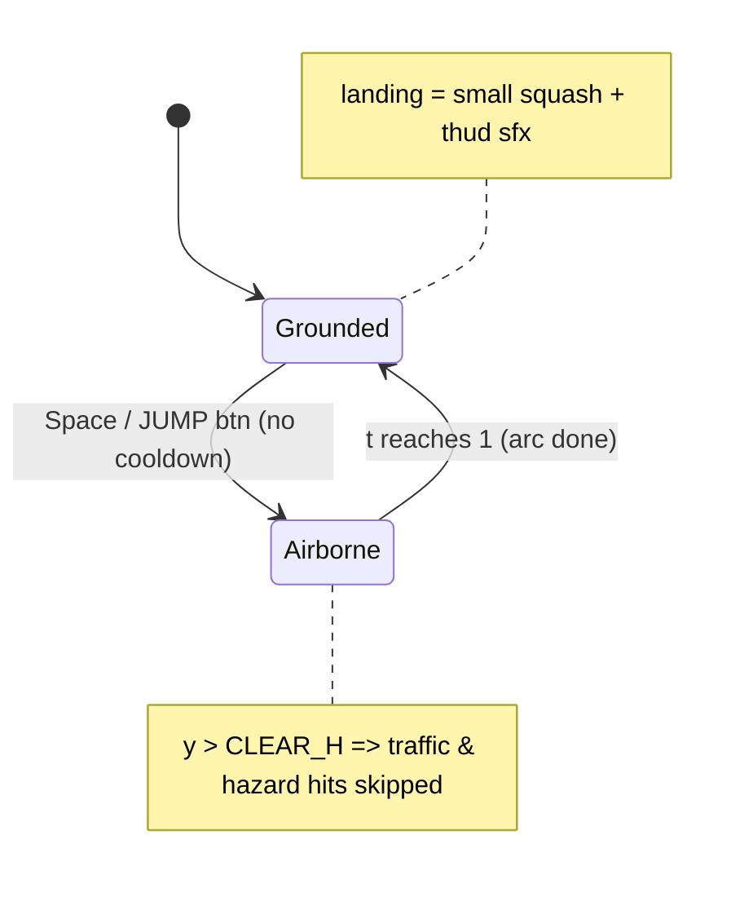

# Turbo Lane — Feature Spec: Jump, Levels & Environments

> Status: Approved (2026-07-26). Source of truth for the implementation.
> Owner: grok (handed off). Coordinator: droid.
> Related: `02-execution-plan.md` (parallel/sequential phases), `03-handoff-brief.md`.

## Goal
Add three feature sets to `workspace/3dcarracer` (the Three.js endless dodger):
1. **Jump** — player car can leap over traffic cars AND new dedicated road hazards; pure-timing, no resource, mistimed jump = crash.
2. **Levels** — discrete level progression with a level-up toast + small per-level speed bump (layered on top of the existing continuous difficulty ramp).
3. **Environments** — 4 biomes (Highway / Beach / Desert / City) that **cycle randomly during a run** (independent of level, so the game stays unpredictable) plus a **menu picker** for the starting biome. Pause is preserved and now surfaces current env + level.

Locked decisions (from the user's Q&A):
- Jump = unlimited / skill-based / timing.
- Env = random mid-run cycling + start-env menu picker (NOT tied to level).
- Levels = indicator + toast + small speed bump.
- Jump clears both traffic cars and new dedicated hazards.

Project constraints honored: **no build step, no npm, vendored Three.js only** — all new code is hand-written ES modules + DOM, matching the existing style in `js/main.js`, `js/car.js`, `js/road.js`, `js/input.js`, `js/audio.js`.

---

## Architecture

```mermaid
flowchart LR
    IN[input.js]:::m --> MJ[main.js loop]:::m
    MJ -->|update dt| PL[player.state]:::new
    MJ -->|spawn| TF[traffic array]:::exist
    MJ -->|spawn| HZ[hazards array]:::new
    MJ -->|collide AABB| PL
    MJ -->|collide AABB| HZ
    PL -.airborne y>clear.-> SKP[skip collide]:::new
    MJ -->|level crossing| LV[level-up toast +speed kick]:::new
    MJ -->|env timer| EN[env tween + seg rebuild]:::new
    EN --> RD[road.js shared mats]:::exist
    EN --> SC[scene bg/fog/lights]:::exist
    classDef new fill:#2e7d32,color:#fff; exist fill:#333,color:#fff; m fill:#1565c0,color:#fff;
```



---

## Feature A — Jump mechanic

**Input (`js/input.js`)**
- Reassign: `Space` → `jump` (one-shot, gated by `!e.repeat`). `Enter` keeps `confirm`.
- Add `jump: false` to input state + `poll()` output (one-shot, cleared each poll like `steerLeft`).
- Touch: new `<button id="jump-btn">` (bottom-left, mirrors `#nitro-btn`). Press = `state.jump = true`.

**Player (`js/car.js`)**
- Extend `state` with: `jumping: false`, `jumpT: 0`, `jumpY: 0`, `grounded: true`.
- Add `jump()` method: if `state.grounded`, set `jumping=true`, `jumpT=0`, `grounded=false`. (No cooldown. No double-jump while airborne.)
- In `update(dt)`:
  - If `jumping`: `jumpT += dt / JUMP_DURATION`; `t = clamp(jumpT,0,1)`; `jumpY = JUMP_HEIGHT * 4 * t * (1-t)` (parabola). Apply `group.position.y = jumpY`. Add pitch: `group.rotation.x = -sin(t*PI) * 0.12` (nose up at apex). On `t>=1`: reset to 0, `grounded=true`, `jumping=false`.
  - On land (`t crossed 1`): trigger a brief squash (scale.y → 0.85 → 1 over 120ms via a `landFlash` timer).
- Add a **ground shadow blob**: a `CircleGeometry` decal at `y=0.02` parented to scene (not the car group, so it stays on the road while the car rises). Scales down / fades slightly with `jumpY` for depth cue.
- Constants (in `car.js`, exported): `JUMP_DURATION = 0.7`, `JUMP_HEIGHT = 2.6`, `AIRBORNE_CLEAR_Y = 0.7`.

**Collision (`js/main.js` → `updatePlaying`)**
- In the traffic loop, guard the existing AABB test with `&& player.state.jumpY < AIRBORNE_CLEAR_Y` (skip if airborne above threshold). Keep near-miss scoring as-is.
- Add a parallel hazards loop (see Feature B) with the same airborne guard.

**HUD/HTML (`index.html`)**
- Add `<button id="jump-btn" class="jump-btn">JUMP</button>` next to `#nitro-btn`.
- Update `.controls-hint`: add `SPACE / JUMP btn — jump`.

**Audio (`js/audio.js`)** — add three synthesized SFX (Web Audio, matching existing style):
- `jump()`: quick upward sine chirp (200→600 Hz, 0.18s).
- `land()`: short low thud (filtered noise burst, 0.12s).
- `levelUp()`: 3-note major arpeggio chime.

---

## Feature B — Jumpable hazards

New low obstacles that **cannot be dodged by lane-change alone in dense traffic** (force a jump or a steer). Reuses the recycle/despawn pattern from traffic.

- **`js/hazard.js` (new)** — `createHazard(scene)` returns `{ group, lane, width, length, speed:0, cleared:false }`. Builds one of: road barrier (red/white striped box), construction cone cluster, or oil drum. All low (~0.5 tall) so a jump clears them. `width≈1.4`, `length≈1.2`.
- **`js/main.js`**: add `let hazards = [];` Reset clears them (like traffic).
  - Spawn cadence: every `HAZARD_INTERVAL` (≈ 9–14s, jittered, only when `difficulty > 0.4` so early game stays gentle). Spawn on a random lane, with the same "don't stack on traffic" check.
  - Move with `group.position.z += speed * dt` (static obstacles, so full `speed` not relative). Spin nothing.
  - Collision AABB (x+z) — skipped when `player.state.jumpY > AIRBORNE_CLEAR_Y`. On ground-level overlap → `endGame()`.
  - Mark `cleared` once passed for a small score bonus (+40, "HAZARD!" whoosh).
  - Despawn at `DESPAWN_Z`.

---

## Feature C — Environments (biomes)

### C1. Biome definitions (`js/environment.js`, new)
Export an `ENVIRONMENTS` map and helpers. Each entry:

```js
{
  id: 'beach', name: 'BEACH',
  sky: 0xafe3ff, fog: 0xcdeaff, fogNear: 60, fogFar: 250,
  ground: 0xe3cf9a,   // shared ground mat color (sand)
  asphalt: 0x33332b,
  sunColor: 0xffffff, sunIntensity: 1.9, sunPos: [-30,55,20],
  hemiSky: 0xd6f0ff, hemiGround: 0xd9c98a, hemiIntensity: 0.9,
  scenery: { trees:false, palms:true, cacti:false, rocks:true, buildings:false, poles:true },
}
```

Four biomes: `highway` (current palette), `beach`, `desert` (sunset orange), `city` (dusk, buildings + neon). `highway` values match today's constants exactly so default look is unchanged.

### C2. Road refactor (`js/road.js`)
- Hoist `groundMat` and `asphaltMat` to module scope as **shared singletons** used by every segment (today each `makeGrass()`/`makeAsphalt()` creates its own — change to share so a color tween recolors the whole road at once).
- Add scenery factories: `makePalm()`, `makeCactus()`, `makeRock()`, `makeBuilding()`. Keep `makeTree()`, `makeLightPole()`.
- `makeSegment()` reads a module-level `activeEnv.scenery` to decide which props to scatter (instead of hardcoded trees+poles). Shoulder rumble stripes stay red/white everywhere.
- `createRoad(scene)` returns `{ update, setEnv(env) }`:
  - `setEnv` stores `activeEnv` (used by next recycled segment) — **no immediate scenery rebuild**; props swap naturally as segments roll through over a few seconds.
- Segment recycle unchanged (z-wrap), just builds with current `activeEnv`.

### C3. Transition + cycling (`js/main.js`)
- Capture references to `scene.background`, `scene.fog`, `sun`, `hemi` (already created).
- Maintain `currentEnv`, `nextEnv`, `envTimer` (random `ENV_CHANGE_MIN..MAX` = 45–75s), `envTween` (progress 0..1 over 1.5s).
- On `envTimer` expiry: pick `nextEnv` = random biome ≠ current. Start tween: lerp `scene.background`, `fog.color`, shared `groundMat.color`, `asphaltMat.color`, `sun.color`/`intensity`, `hemi` colors toward target (use `THREE.Color.lerpColors`). Call `road.setEnv(nextEnv)` so recycled segments adopt new props. When tween done, `currentEnv = nextEnv`.
- All tweening only advances inside `updatePlaying` → **auto-pauses** when paused/menu (satisfies the pause requirement).
- HUD badge `#env-label` shows `currentEnv.name`, updates on each switch (with a quick fade).

### C4. Menu picker (`index.html` + `css/style.css`)
- In `#menu`, add an env picker row above START: 5 buttons — `Highway / Beach / Desert / City / 🎲 Surprise`. Selected one gets `.selected` styling; `Surprise` = random start biome.
- Store `selectedStartEnv` (persist to `localStorage` key `turbolane_env`). On `startGame()`, set `currentEnv` = selection (or random for Surprise), apply immediately, then random cycling takes over.

### C5. Pause surfaces env + level
- `#pause` overlay gains two small lines: `LEVEL <n>` and `ENV <name>` so a paused player sees context. Existing Resume/Quit buttons untouched.

---

## Feature D — Levels (enhanced)

Today: `LV = 1 + floor(difficulty*2)` (cosmetic, derived from `difficulty = min(2.5, score/3000)`). Keep the continuous `difficulty` for spawn-rate scaling. Add a **separate, explicit** level:

- `js/main.js`: `LEVEL_STEP = 1500` (points per level). `level = 1 + floor(score / LEVEL_STEP)`. `prevLevel` tracked.
- On `level > prevLevel` (checked each frame in `updatePlaying`):
  - **Toast**: show `#level-toast` ("LEVEL 2") — CSS slide-down + fade, auto-hide 1.8s.
  - **Speed bump**: `speed = min(effectiveMax, speed + LEVEL_SPEED_KICK)` (`LEVEL_SPEED_KICK = 10`). One-time per crossing.
  - **Audio**: `audio.levelUp()`.
  - **HUD pulse**: `#level-label` flashes (CSS class toggle for 0.5s).
- `#level-label` text now driven by `level` (replaces the old formula). Cap display at LV 20 for sanity; difficulty/spawn keep ramping via the continuous value.
- Pause overlay also shows `level` (see C5).

---

## Cross-cutting changes

| Area | Change |
|---|---|
| `index.html` | Add `#jump-btn`, `#level-toast`, `#env-label`, menu env-picker row, pause info lines; update controls hint. |
| `css/style.css` | `.jump-btn` (blue, bottom-left, mirror nitro btn, touch-only via existing media query), `#level-toast` animation, `#env-label` badge, `.env-btn` / `.env-btn.selected` cards, `#level-label.flash`. |
| `js/input.js` | `Space→jump`, `jump` one-shot in state + poll, `#jump-btn` press/release. |
| `js/audio.js` | `jump()`, `land()`, `levelUp()` synthesized SFX. |
| `resetGame()` | Also reset jump state (`grounded=true, jumpY=0`), clear `hazards`, `envTimer`, `level`/`prevLevel`, apply selected start env. |
| `quitToMenu()` | Clear hazards like traffic. |

---

## Tuning constants (all in one place, easy to tweak)

| Constant | Value | Where |
|---|---|---|
| `JUMP_DURATION` | 0.7 s | car.js |
| `JUMP_HEIGHT` | 2.6 u | car.js |
| `AIRBORNE_CLEAR_Y` | 0.7 u | car.js |
| `HAZARD_INTERVAL` | 9–14 s (random) | main.js |
| `HAZARD_SCORE_BONUS` | 40 | main.js |
| `LEVEL_STEP` | 1500 pts | main.js |
| `LEVEL_SPEED_KICK` | +10 (clamped) | main.js |
| `ENV_CHANGE_MIN/MAX` | 45 / 75 s | main.js |
| `ENV_TWEEN` | 1.5 s | main.js |

---

## Verification plan
1. `python3 -m http.server 8000` from `workspace/3dcarracer`, open browser, no console errors.
2. **Jump**: Space → car arcs up; while airborne, drive through a traffic car without crashing; land thud + shadow scale. Mistime a low jump into a car → crash as expected.
3. **Hazards**: barriers spawn at higher difficulty; jump over → +40 + whoosh; drive into one on ground → crash.
4. **Levels**: cross 1500 pts → toast + speed kick + chime + label flash; pause shows level.
5. **Environments**: pick each biome in menu → correct start look; wait 45–75s → smooth color tween + scenery swap; badge updates; pause shows env.
6. **Pause**: P/ESC/btn pauses everything (jump arc, env tween, timers all freeze); resume continues cleanly.
7. Touch: JUMP button works; nitro button still works.
8. No regressions in steering, nitro, near-miss, best-score persistence.

## Non-goals (out of scope)
- No double-jump / air-dash.
- No new player car models or car customization.
- No background music (SFX only, as today).
- No multiplayer / leaderboard.
- Biome-specific obstacle behavior (hazards behave identically in all biomes).
